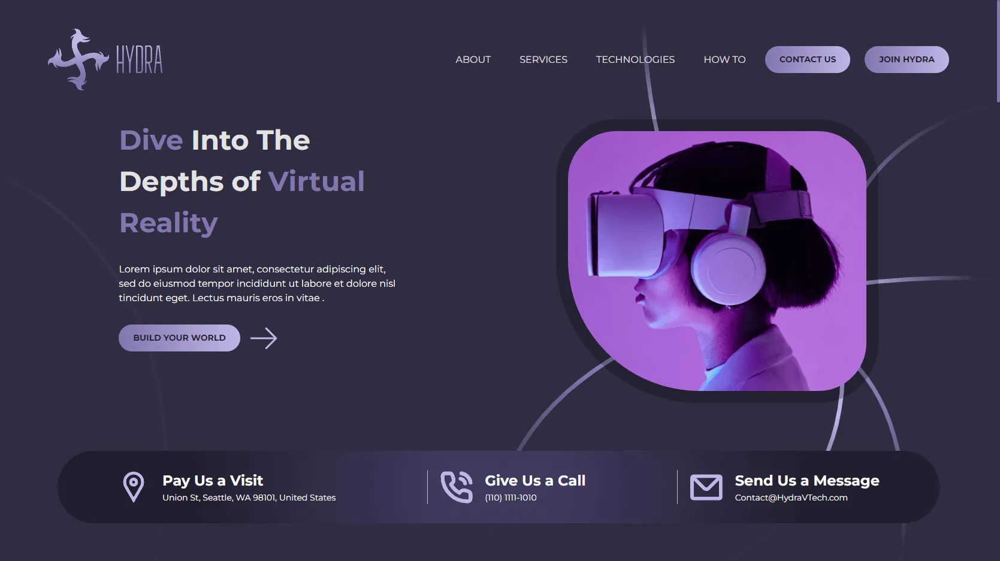

# Hydra VR

The project in question is based on a design created by Zine, and visual effects have been added that simulate virtual reality, providing a more immersive and exciting experience for the user. But that's not all, this project also has an essential feature for any modern digital product: responsiveness.

The application adjusts efficiently and smoothly to different screen sizes, offering a satisfying and seamless experience on both mobile devices and desktop computers. In short, this project combines an attractive design with advanced technologies to provide a unique and satisfying user experience.

## Overview

### Links

- Live Site URL: [Hydra](https://hydravr.netlify.app/)

## My process

### Built with

- [Vitejs](https://vitejs.dev/)
- [React.js](https://reactjs.org/)
- [Styled-components](https://styled-components.com/docs/basics)
- [AtroposJS](https://atroposjs.com/)

## Author

- Developer - [StalinAM](https://github.com/StalinAM)
- Designer - [Zine](https://www.figma.com/@zinefalouti)
